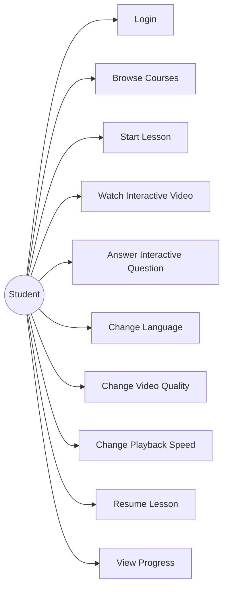
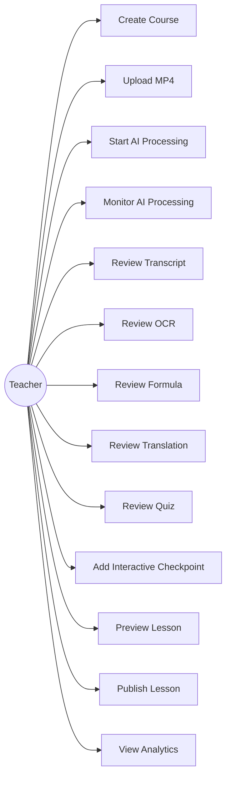
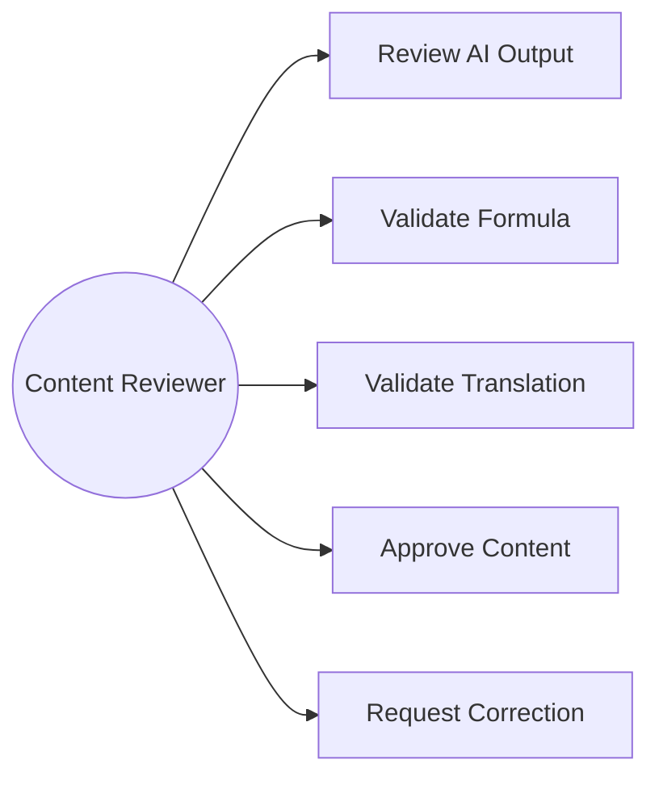
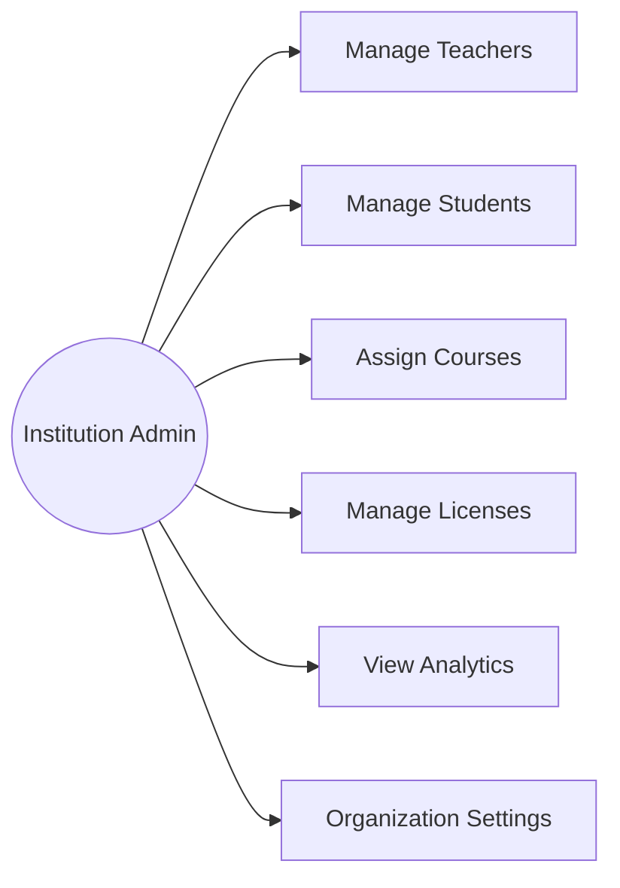
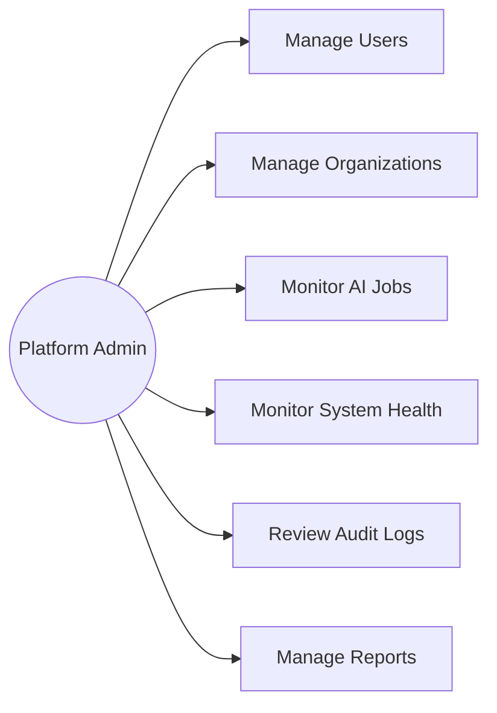
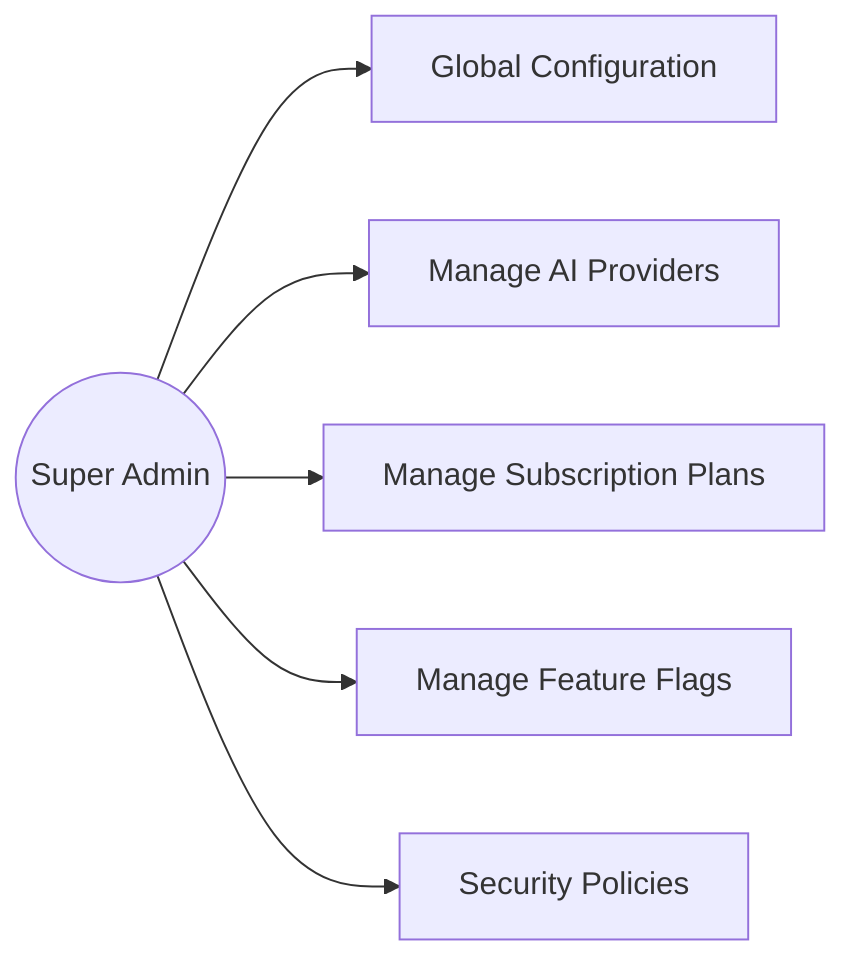
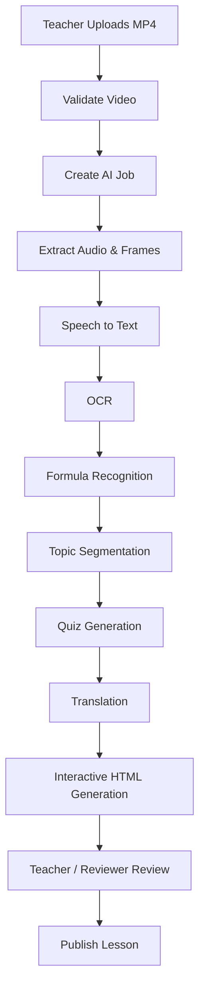
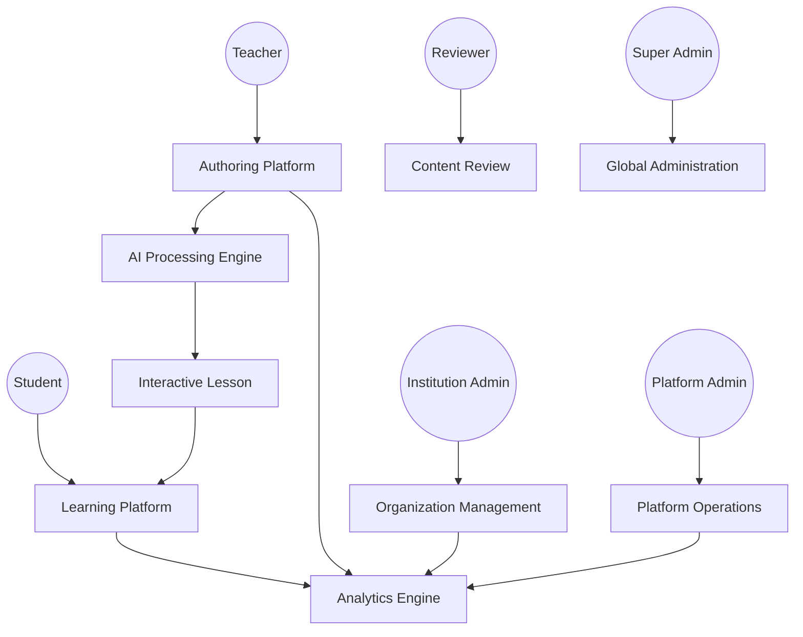

# Use Case Diagrams

## 1. Purpose

This document defines the major actors and use cases of the AILPG platform.

The objective is to provide a clear mapping between:

- Users
- System capabilities
- AI workflows
- Administration
- Learning activities
- Subscription controls

---

# 2. System Actors

AILPG contains six primary human roles:

1. Student
2. Teacher
3. Content Reviewer
4. Institution Administrator
5. Platform Administrator
6. Super Administrator

External system actors include:

7. AI Provider
8. Object Storage
9. Payment Provider
10. Notification Provider

---

# 3. Actor Overview

| Actor | Primary Responsibility |
|---|---|
| Student | Consume interactive learning content |
| Teacher | Create and publish learning content |
| Reviewer | Validate AI-generated content |
| Institution Admin | Manage organization |
| Platform Admin | Operate platform |
| Super Admin | Manage global configuration |
| AI Provider | Perform AI processing |
| Object Storage | Store large media/files |
| Payment Provider | Process subscriptions |
| Notification Provider | Deliver notifications |

---

# 4. Student Use Cases

## UC-STU-001 — Login

Student authenticates into the platform.

## UC-STU-002 — Browse Courses

Student views available courses.

## UC-STU-003 — Start Lesson

Student opens a published lesson.

## UC-STU-004 — Watch Interactive Video

Student watches the educational video.

## UC-STU-005 — Answer Interactive Question

Video pauses at a configured checkpoint and displays a question.

Student submits an answer and continues learning.

## UC-STU-006 — Change Language

Student selects a supported language.

## UC-STU-007 — Change Video Quality

Student selects an available video quality.

Possible levels:

```text
Auto
1080p
720p
480p
360p
```

Availability depends on the lesson, device, network, and subscription entitlement.

## UC-STU-008 — Change Playback Speed

Student can select:

```text
0.5x
0.75x
1x
1.25x
1.5x
2x
```

## UC-STU-009 — Resume Lesson

Student continues from the last saved position.

## UC-STU-010 — View Progress

Student views:

- Lesson progress
- Course progress
- Quiz score
- Completion status

---

# 5. Student Use Case Diagram



---

# 6. Teacher Use Cases

## UC-TEA-001 — Login

Teacher authenticates into the platform.

## UC-TEA-002 — Create Course

Teacher creates:

- Course
- Chapter
- Lesson

## UC-TEA-003 — Upload MP4

Teacher uploads the source mathematical video.

## UC-TEA-004 — Start AI Processing

The system creates an AI processing job.

## UC-TEA-005 — Monitor Processing

Teacher monitors:

- Upload status
- AI status
- Processing stage
- Errors
- Completion

## UC-TEA-006 — Review Transcript

Teacher reviews and edits generated transcript.

## UC-TEA-007 — Review OCR

Teacher reviews text detected from video frames.

## UC-TEA-008 — Review Formula

Teacher validates mathematical formulas.

## UC-TEA-009 — Review Translation

Teacher validates translated content.

## UC-TEA-010 — Review Quiz

Teacher reviews generated questions.

## UC-TEA-011 — Add Interactive Checkpoint

Teacher can place a question at a specific video timestamp.

Example:

```text
00:02:35
     ↓
Video pauses
     ↓
Question appears
     ↓
Student answers
     ↓
Feedback
     ↓
Video continues
```

## UC-TEA-012 — Preview Lesson

Teacher previews the final interactive lesson.

## UC-TEA-013 — Publish Lesson

Teacher publishes an approved lesson.

## UC-TEA-014 — View Analytics

Teacher views:

- Watch time
- Completion
- Quiz performance
- Drop-off points
- Replay points

---

# 7. Teacher Use Case Diagram



---

# 8. Reviewer Use Cases

## UC-REV-001 — Review AI Output

Reviewer validates generated content.

## UC-REV-002 — Approve Content

Reviewer approves content for publishing.

## UC-REV-003 — Request Correction

Reviewer sends content back for correction.

## UC-REV-004 — Validate Formula

Reviewer checks mathematical correctness.

## UC-REV-005 — Validate Translation

Reviewer checks translated educational content.

---

# 9. Reviewer Diagram



---

# 10. Institution Administrator Use Cases

## UC-ORG-001 — Manage Teachers

Create, disable, and manage teacher accounts.

## UC-ORG-002 — Manage Students

Manage student accounts.

## UC-ORG-003 — Assign Courses

Assign courses to users or groups.

## UC-ORG-004 — Manage Licenses

View and allocate available licenses.

## UC-ORG-005 — View Organization Analytics

Monitor organizational learning metrics.

## UC-ORG-006 — Manage Organization Settings

Configure organization-level settings.

---

# 11. Institution Admin Diagram



---

# 12. Platform Administrator Use Cases

## UC-ADM-001 — Manage Users

Platform-wide user management.

## UC-ADM-002 — Manage Organizations

Create and manage organizations.

## UC-ADM-003 — Monitor AI Jobs

Monitor:

- Queue
- Processing
- Failures
- Retries

## UC-ADM-004 — Monitor System Health

Monitor:

- API health
- Database
- Queue
- Storage
- AI workers

## UC-ADM-005 — Review Audit Logs

Review security-sensitive activities.

## UC-ADM-006 — Manage Reports

Access platform-level reports.

---

# 13. Platform Admin Diagram



---

# 14. Super Administrator Use Cases

## UC-SUP-001 — Global Configuration

Manage platform-wide configuration.

## UC-SUP-002 — Manage AI Providers

Configure supported AI providers.

## UC-SUP-003 — Manage Subscription Plans

Configure plans and entitlements.

## UC-SUP-004 — Manage Feature Flags

Enable or disable platform features.

## UC-SUP-005 — Manage Security Policies

Configure global security policies.

---

# 15. Super Admin Diagram



---

# 16. AI Processing Use Case

The AI pipeline is triggered when a Teacher uploads an MP4.



---

# 17. Complete Platform Use Case Map



---

# 18. Core End-to-End Use Case

## UC-END-001 — MP4 to Interactive Lesson

### Actor

Teacher

### Preconditions

- Teacher is authenticated.
- Teacher has permission to create content.
- Subscription allows AI processing.

### Main Flow

1. Teacher creates a lesson.
2. Teacher uploads MP4.
3. System validates the file.
4. System stores the original video.
5. System creates AI job.
6. AI worker extracts audio.
7. STT generates transcript.
8. OCR detects visible text.
9. Formula engine detects mathematical expressions.
10. AI identifies learning segments.
11. AI generates interactive questions.
12. Translation service generates selected languages.
13. Lesson generator creates interactive lesson data.
14. Teacher reviews generated content.
15. Teacher edits incorrect content.
16. Teacher previews lesson.
17. Teacher publishes lesson.
18. Student opens lesson.
19. Student watches video.
20. Video pauses at checkpoints.
21. Student answers questions.
22. System records learning events.
23. Student completes lesson.
24. Analytics are updated.

---

# 19. Alternative Flow — AI Failure

If an AI processing stage fails:

```text
AI Stage Failed
      │
      ▼
Record Error
      │
      ▼
Retry Automatically
      │
      ├── Success → Continue Pipeline
      │
      └── Failure → Manual Retry / Review
```

Previously completed stages should not unnecessarily be repeated.

---

# 20. Alternative Flow — Student Wrong Answer

```text
Question
   │
   ▼
Student Answer
   │
   ├── Correct
   │      ↓
   │   Positive Feedback
   │      ↓
   │   Continue Video
   │
   └── Incorrect
          ↓
      Feedback
          ↓
      Optional Hint
          ↓
      Retry / Continue
```

The exact behavior should be configurable per lesson.

---

# 21. Permission Matrix

| Feature | Student | Teacher | Reviewer | Org Admin | Platform Admin | Super Admin |
|---|:---:|:---:|:---:|:---:|:---:|:---:|
| Watch Lesson | ✓ | ✓ | ✓ | ✓ | ✓ | ✓ |
| Upload MP4 | ✗ | ✓ | ✗ | Optional | ✓ | ✓ |
| Edit Transcript | ✗ | ✓ | ✓ | ✗ | ✓ | ✓ |
| Edit Formula | ✗ | ✓ | ✓ | ✗ | ✓ | ✓ |
| Edit Quiz | ✗ | ✓ | ✓ | ✗ | ✓ | ✓ |
| Publish | ✗ | ✓ | ✓ | Optional | ✓ | ✓ |
| View Student Analytics | Own | Course | Course | Organization | Platform | Global |
| Manage Users | ✗ | Limited | ✗ | Organization | Platform | Global |
| Manage AI Providers | ✗ | ✗ | ✗ | ✗ | Limited | ✓ |
| Manage Subscription Plans | ✗ | ✗ | ✗ | ✗ | Limited | ✓ |

---

# 22. Use Case Naming Convention

Use case IDs shall follow:

```text
UC-[ROLE]-[NUMBER]
```

Examples:

```text
UC-STU-001
UC-TEA-001
UC-REV-001
UC-ORG-001
UC-ADM-001
UC-SUP-001
```

---

# 23. Related Documents

- SRS-001 — SRS Overview
- SRS-002 — System Context
- SRS-004 — Detailed Use Cases
- SRS-005 — System Features
- BRD-009 — Functional Requirements
- BRD-014 — Acceptance Criteria
- Database Design
- API Design
- AI Workflow

---

# 24. Revision History

| Version | Date | Description |
|---|---|---|
| 1.0.0 | 2026-08-11 | Initial Use Case Diagrams |
